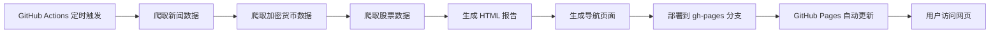

# 📦 GitHub Pages 部署指南

## 🎯 功能说明

TrendRadar 支持自动部署到 GitHub Pages，让用户可以直接访问网页查看实时报告。

**访问地址**：`https://你的用户名.github.io/TrendRadar/`

例如：`https://cecwxf.github.io/TrendRadar/`

---

## 🚀 快速部署（3 步）

### 步骤 1：启用 GitHub Pages

1. 进入 GitHub 仓库
2. 点击 **Settings** → **Pages**
3. 在 "Source" 下拉菜单中选择：
   - **Branch**: `gh-pages`
   - **Folder**: `/ (root)`
4. 点击 **Save**


---

### 步骤 2：配置 Secrets（必需）

进入：**Settings** → **Secrets and variables** → **Actions**

**至少配置一个通知渠道**（否则爬虫会跳过通知）：

| Secret 名称 | 说明 | 示例 |
|------------|------|------|
| `FEISHU_WEBHOOK_URL` | 飞书机器人 Webhook | `https://open.feishu.cn/...` |
| `DINGTALK_WEBHOOK_URL` | 钉钉机器人 Webhook | `https://oapi.dingtalk.com/...` |
| `WEWORK_WEBHOOK_URL` | 企业微信机器人 Webhook | `https://qyapi.weixin.qq.com/...` |

**可选配置**：

| Secret 名称 | 说明 |
|------------|------|
| `CLAUDE_API_KEY` | Claude API Key（启用 AI 分析） |

---

### 步骤 3：触发第一次部署

有两种方式触发部署：

#### 方法 A：手动触发（推荐）

1. 进入 **Actions** 标签
2. 选择 **Get Hot News** workflow
3. 点击 **Run workflow** → **Run workflow**
4. 等待 2-3 分钟

#### 方法 B：等待定时任务

- 默认每小时自动运行一次（每小时第 33 分钟）

---

## 📊 查看部署结果

### 检查部署状态

1. **Actions** 标签 → 查看最新运行记录
2. 展开 **Deploy to GitHub Pages** 步骤
3. 确认显示 ✓ 成功

### 访问网页

部署成功后，访问：

```
https://cecwxf.github.io/TrendRadar/
```

**主页功能**：
- ✅ 3 秒自动跳转到最新报告
- ✅ 显示核心功能介绍
- ✅ 显示数据来源统计

**报告页面**：
- ✅ 实时热点新闻分析
- ✅ 加密货币行情（BTC、ETH、BNB）
- ✅ 股票市场数据（美股、港股、A股）
- ✅ 支持保存为图片

---

## ⚙️ 工作原理



**关键文件**：
- `.github/workflows/crawler.yml` - GitHub Actions workflow
- `scripts/generate_index.py` - 生成导航页面脚本
- `output/` - 生成的报告目录（部署到 GitHub Pages）

---

## 🔧 自定义配置

### 修改更新频率

编辑 `.github/workflows/crawler.yml` 第 38 行：

```yaml
# 当前：每小时第 33 分钟
- cron: "33 * * * *"

# 改为：每 2 小时第 15 分钟
- cron: "15 */2 * * *"

# 改为：每天 8:00 和 20:00（UTC 时间）
- cron: "0 0,12 * * *"
```

### 保留历史报告

默认配置每次部署会覆盖之前的报告。如需保留历史：

编辑 `.github/workflows/crawler.yml`，修改：

```yaml
- name: Deploy to GitHub Pages
  uses: peaceiris/actions-gh-pages@v3
  with:
    github_token: ${{ secrets.GITHUB_TOKEN }}
    publish_dir: ./output
    publish_branch: gh-pages
    keep_files: true  # 改为 true 保留历史文件
```

**注意**：保留历史会增加仓库大小。

### 禁用自动跳转

如果不想要 3 秒自动跳转，编辑 `scripts/generate_index.py`：

```python
# 找到这一行（第 390 行左右）：
let countdown = 3;

# 改为：
let countdown = 0;  # 0 秒 = 禁用自动跳转
```

然后提交并推送：

```bash
git add scripts/generate_index.py
git commit -m "禁用自动跳转"
git push
```

---

## 🛠️ 故障排查

### 问题 1：GitHub Pages 显示 404

**可能原因**：
- gh-pages 分支还未创建
- GitHub Pages 未启用

**解决方法**：
1. 确认 Actions 运行成功
2. 检查是否有 gh-pages 分支
3. 重新配置 GitHub Pages（步骤 1）

### 问题 2：网页显示但数据为空

**可能原因**：
- 爬虫运行失败
- 未配置通知渠道导致跳过

**解决方法**：
1. 查看 Actions 日志
2. 确认至少配置了一个通知渠道
3. 检查 `config/config.yaml` 配置是否正确

### 问题 3：自动跳转失败

**可能原因**：
- 当天还没有生成报告
- 报告路径不匹配

**解决方法**：
1. 手动触发一次 Actions
2. 等待爬虫运行完成
3. 检查 `output/` 目录结构

### 问题 4：部署失败

**错误信息**：`Error: Action failed with "The process '/usr/bin/git' failed with exit code 128"`

**解决方法**：
1. 确认 workflow 中 permissions 正确配置：
   ```yaml
   permissions:
     contents: write
     pages: write
     id-token: write
   ```
2. 重新触发 Actions

---

## 📊 访问统计

### 添加 Google Analytics

编辑 `scripts/generate_index.py`，在 `</head>` 前添加：

```html
<!-- Google Analytics -->
<script async src="https://www.googletagmanager.com/gtag/js?id=G-XXXXXXXXXX"></script>
<script>
  window.dataLayer = window.dataLayer || [];
  function gtag(){dataLayer.push(arguments);}
  gtag('js', new Date());
  gtag('config', 'G-XXXXXXXXXX');
</script>
```

替换 `G-XXXXXXXXXX` 为你的 GA ID。

---

## 🎨 自定义样式

### 修改主题颜色

编辑 `scripts/generate_index.py`，找到 CSS 部分：

```css
/* 当前：紫色渐变 */
background: linear-gradient(135deg, #667eea 0%, #764ba2 100%);

/* 改为：蓝色渐变 */
background: linear-gradient(135deg, #4facfe 0%, #00f2fe 100%);

/* 改为：红色渐变 */
background: linear-gradient(135deg, #fa709a 0%, #fee140 100%);
```

---

## 🚀 进阶功能

### 自定义域名

1. 购买域名（如 `trendradar.com`）
2. 在域名DNS添加 CNAME 记录：
   ```
   CNAME  www  cecwxf.github.io
   ```
3. 在 GitHub → Settings → Pages → Custom domain 输入域名
4. 等待 DNS 生效（通常几分钟）

### HTTPS 证书

GitHub Pages 自动提供免费 HTTPS 证书（Let's Encrypt）。

启用方法：
- GitHub → Settings → Pages → 勾选 "Enforce HTTPS"

---

## 📝 完成清单

部署完成后，确认以下事项：

- [ ] ✅ GitHub Pages 已启用（Settings → Pages）
- [ ] ✅ 至少配置了一个通知渠道 Secret
- [ ] ✅ 手动触发 Actions 成功运行
- [ ] ✅ 可以访问 `https://你的用户名.github.io/TrendRadar/`
- [ ] ✅ 主页能自动跳转到最新报告
- [ ] ✅ 报告页面显示加密货币和股票数据

---

## 🆘 获取帮助

- **GitHub Issues**: https://github.com/cecwxf/TrendRadar/issues
- **查看日志**: Actions → 点击运行记录 → 展开步骤查看详情
- **文档**: 查看 GITHUB_DEPLOYMENT_GUIDE.md

---

## 🎉 部署成功！

一旦配置完成，您的 TrendRadar 将：
- ✅ 每小时自动更新
- ✅ 生成精美的 HTML 报告
- ✅ 部署到 GitHub Pages
- ✅ 任何人都可以访问

**示例网址**：
- 主页：`https://cecwxf.github.io/TrendRadar/`
- 最新报告：`https://cecwxf.github.io/TrendRadar/2025-12-30/html/当前榜单汇总.html`

享受自动化的信息流！🚀
